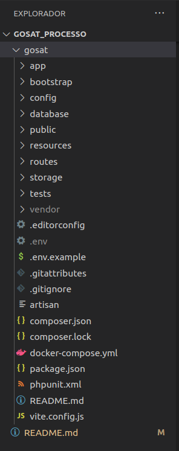
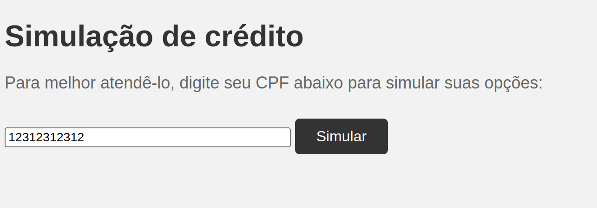
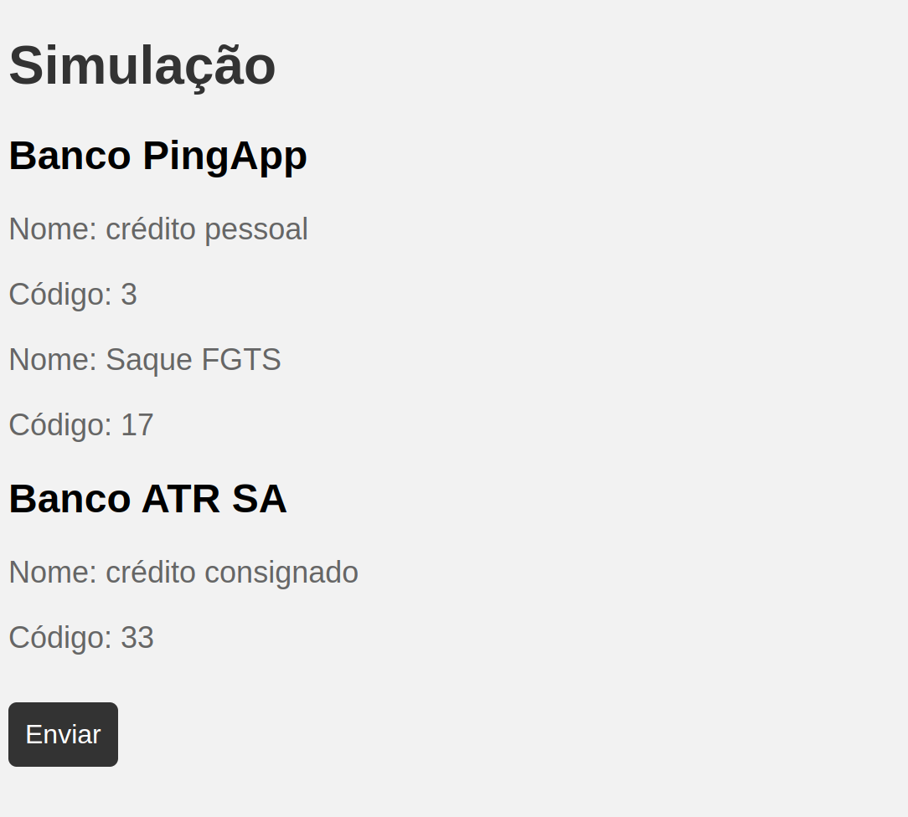
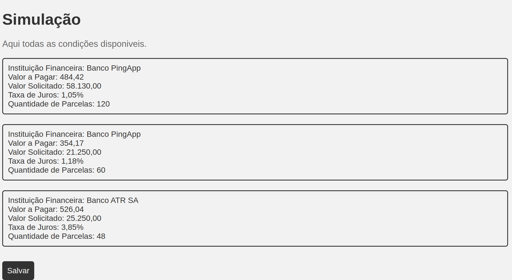
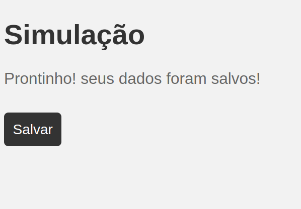

# GOSAT - FullStack Teste

# 📁 Tecnologias #
Esse projeto foi desenvolvido com as seguintes tecnologias e métodos:

* <a href="https://laravel.com/">Laravel</a>
* <a href="https://www.php.net/docs.php">PHP</a>
* <a href="https://www.mysql.com/">MySQL</a>
* <a href="https://www.javascript.com/">JavaScript</a>
* <a href="https://www.docker.com/">Docker Compose</a>

# 💻 Projeto #
O projeto foi desenvolvido para o processo seletivo da gosat, onde foi desenvolvido um sistema de simulação de financiamentos, onde o usuário pode simular um financiamento de acordo com o valor que precisa, valor da entrada, quantidade de parcelas e taxa de juros. 

# 🎬 Demonstrações

## Arquitetura

## Projeto

   

# Iniciando o projeto #
*Clone o projeto para acessá-lo*
~
$ git clone git@github.com:estevao144/gosat_processo.git
~
A branch mais atualizada é a, então acesse ela por `git checkout main`

*Siga os passos abaixo*
~
# Entre na pasta correta para começar
$ cd gosat/
~
# Instale as dependências
$ composer install
~
# Rode o projeto com docker
$ docker-compose up -d
~
# Rode as migrations
$ php artisan migrate
~
# Rode o projeto
$ php -S localhost:8000 -t public
~
O app estará disponível na url: http://localhost:8000
~
# ✨ Muito obrigado! ✨ #
Code with 💙 by me!, [Estevão Marques](https://www.linkedin.com/in/estevaomarqueso/)
